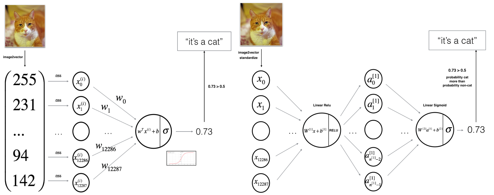

앤드류 응 선생님의 딥러닝 전문가 코세라 강의. 2017년에 나온 강의기에 최신 트렌드를 담았다고 볼 수는 없으나 딥러닝 기초를 다지기에 좋은 강의이다. 이미 머신러닝과 딥러닝의 기초적인 내용은 학부와 대학원 시절 강의들을 통해 충분히 배웠지만, 시간이 지나서인지 기초가 가물가물해지기 시작했다. 🤔처음에는 석사 과정에서 다시 기초를 듣는다는 것이 머뭇거려 졌지만, 첫 주차 강의를 듣고 그 생각이 바뀌었다. 강의를 통해 이론을 복습하고 실습을 통해 구현 연습을 하니 도움이 많이 되었다. 다른 사람들도 이 강의를 통해 딥러닝 AI 지식 기초를 다질 수 있을 것이라 확신한다. 구글 부트캠프 2020 코스에서도 본 강의를 들으면 머신러닝 엔지니어 기초 자격을 획득했다고 가정하니 좋은 강의임에 틀림없다.
 
본 코스는 총 5개로 구성되어 있으며, 배웠던 내용을 개인적인 복습 차원에서 요약 및 정리를 하려고 한다. 역전파 등의 복잡한 수식 과정은 유튜브에서나 다른 자료에서 훨씬 더 잘 설명하고 있으니 생략한다. 

## Course 1. Neural Networks and Deep Learning

## Logistic Regression
딥러닝을 배우기에 앞서 먼저 기초가 되는 `Logistic Regression` 에 대해 익혀야 한다. `Logistic Regression` 은 어떤 x (features)를 통해 Y를 예측하는데 활용되는 기본 선형 확률 모델이다. 강의에 나왔던 예시로 예를 들자면 **어떤 사진**이 주어졌을 때 **사진이 고양이인지 강아지인지 판단하는 이진 분류 문제**를 풀기 위해 사용되는 기초 모델이다. 

고양이인지, 강아지인지에 대한 예측 정확도를 `Logistic Regression`은 0에서 1 사이의 확률로 표현해준다. 이를 수식으로 나타낸다면 예측값인 $\hat{y}$은 다음과 같이 표현할 수 있다. 
$$\hat{y} = \sigma(W^Tx + b)$$

- $\sigma$ : `sigmoid` 함수
- W, b : 모델의 파라미터

여기서 중요한 부분은 `sigmoid`함수인데, 아래 그림을 통해 `sigmoid`함수는. 어떠한 값을 받아도 0 ~ 1 사이의 값으로 변환해주는 것을 볼 수 있다.  **즉, `Logistic Regression` 은 0 ~ 1 사이의 확률값으로 어떤 예측에 대한 수치를 표현하는 것이 핵심이다.** 

---
### 비용 함수
`Logistic Regression` 모델을 훈련시키기 위해서는 먼저 **Loss function**를 정의해야 한다. 이전에 `Logistic Regression` 으로부터 나온 예측값을 $y$가 아닌 $\hat{y}$으로 표현했다. 이 예측값을 원래의 정답과 비교하면서 모델을 개선한다. 만약 모델이 초기에 고양이 사진을 강아지로 예측했다면, 고양이로 예측하도록 모델의 파라미터를 수정해야 한다. 다시 말해 정답과 예측값의 차이를 줄여나가는 것이 학습의 목적이며, 정답과 예측값의 차이를 수식으로 나타낸 것이 비용 함수이다. 비용 함수는 Loss function, Cost function 등으로 표현되며 풀어야 하는 문제에 따라서 식이 다르다. 

`Logistic Regression`에서는 이진 분류를 다루기에 단순히 아래처럼 예측값과 정답 간 차이의 제곱을 Loss function으로 설정할 수도 있다. 
$$L(\hat{y}, y) = \frac{1}{2}(\hat{y} - y)^2$$
그러나 `gradient descent` (모델이 훈련 과정에서 찾아야 할 최소값)의 최적값을 찾기 힘들다는 단점때문에 비슷한 역할을 하는 로그 함수를 사용한다. 
$$L(\hat{y}, y) = -(ylog\hat{y} + (1-y)log(1-\hat{y}))$$

직관적으로 위 식은 만약 $y$가 1일 경우 비용 함수를 최소화하기 위해 $\hat{y}$가 커지는 방향으로 학습을 진행하고, $y$가 0일 경우 $\hat{y}$이 작아지는 방향으로 학습이 진행되기 때문에 적절한 식이라고 볼 수 있다.

Loss function과 유사한 용어로 Cost function도 있는데, Loss function과 개념적으로는 차이가 거의 없는 Cost functionㄷ. 다만 차이가 있다면 Loss function은 단일(single) training example에 대한 error 이며, Cost function은 전체 training set에 대한 error의 평균이다. 어쨌거나 말하고자 하는 것은 같기에 이후 용어는 비용 함수 $J$ 로 통일하겠다.

---
### Gradient Descent
모델이 어떠한 input을 보다 더 정답에 가깝게 예측하기 위해서는 **비용 함수 J**를 최소화해야 한다. 이 비용 함수는 $y$와 $\hat{y}$로 정의되며 그렇기에 파라미터 W와 b로 구성되어 있다. 우리는 이제 비용 함수 J를 최소로 만드는 W와 b를 찾는 것이 목적이다. 이러한 파라미터 W와 b를 찾기 위해 사용되는 알고리즘이 gradient descent algorithm(경사 하강법) 이며, 어떤 함수의 최소값을 찾기 위해 사용되는 일반적인 방법이다. 함수의 기울기를 구하고, 경사의 절대값이 낮은 방향으로 이동하는 것이다. 아마 이 분야를 처음 접하면 일차 난관이 여기일 것이라 생각된다. 말은 어렵지만 사실 어렵지 않은 개념이다. 

(b는 고려하지 않고 w만 고려함) 위 그림에서 w가 목표로 해야할 값은 global optimum이다. 만약 기울기가 음수라면, global optimum이 가장 기울기 경사가 급격한 오른쪽에 있을 것이라고 가정한다. 그러므로 다음 w = w + 양수. 만약 기울기가 양수라면, global optimum은 기울기 경사가 급격한 방향인 왼쪽에 있을 것이라고 가정하고 w = w - 양수. 이러한 w를 업데이트 과정을 식으로 표현한다면 다음과 같다. 
$$w := w - \alpha \frac{dJ(w)}{dw}$$
- $\alpha$ : 학습율. w가 다음에 얼마나 옆으로 갈 지에 대한 하이퍼파라미터
- $\frac{dJ(w)}{dw}$ :  w의 변화율 (기울기)

즉, 이후로는 비용함수를 갱신하고 계속해서 위 식을 반복함으로써 w를 새롭게 업데이트 해나가면서  학습이 진행한다. 그렇다면 더 자세하게, 어떻게 학습이 진행되는가? 는 생략. 역전파 유튜브를 찾아보자.

---
## Neural Network
로지스틱 회귀 모델에 여러 층을 추가하여 확장한 것이 바로 신경망 모델이다. 코세라 실습 강의 자료로 비교하자면 다음과 같다. 

정말 로지스틱 회귀에 하나 레이어가 추가되기만 해도 신경망 모델이라 불린다. 위와 같은 형태의 신경망 모델은 input layer, hidden layer, output layer 총 3가지 레이어가 있는 단순한 형태로, 2-layer 신경망 모델이라 불리운다. **일반적으로 신경망 모델에서 input layer는 수로 안 센다고 한다** 

### Activation functions
모든 학습과 역전파 과정은 로지스틱 회귀 때와 유사하나, 한 층 쌓였다고 파라미터 수가 상당히 복잡해져서 이차 난관이 온다. 일단 새로운 하이퍼파라미터도 추가되는데, 단순히 sigmoid 함수를 사용했던 로지스틱 회귀 모델과 달리 신경망 모델에서는 층마다 activation function(활성 함수)를 달리 설정해주곤 한다. 간단히 활성 함수의 종류와 활용도를 언급하고 마친다.

#### Sigmoid

- 한가지 예외 **이진 분류 문제의 출력층**일 경우를 제외하고는 딥러닝에서 거의 사용되지 않는다.  

- 거의 대부분 sigmoid 보다 성능이 좋다. 
- 정확한 이유는 알 수 없지만 출력값이 -1에서 1 사이의 값으로 나오면서 평균값이 0에 가깝게 해주기 때문. **데이터가 중심에 오기 때문에 성능을 향상시켜 준다고 한다.**

sigmoid와 tanh의 치명적인 한계는, z 값이 매우 크거나 작을 때 gradient (기울기)가 0에 가깝게 된다는 점이다. 이는 gradient descent의 수렴 속도를 매우 느리게 하기 때문에 잘 사용되지 않는다.

- **앤드류응 선생님 추천**
- 1. 음수 일 때 0이 되는 것은 단점일 수 있으나, 실제로는 작동 잘한다.
- 2. 빠르다! (함수가 단순해서) 
- 3. 0으로 가면 학습 속도 저하의 가능성이 있지만, 일반적으로 z는 양수이기 때문에 빠른 편. 거의 항상 작동이 잘 된다고 한다.

**ReLU의 변형태인 Leaky ReLU가 이후 등장하였지만, 딱히 좋은 성능 차이를 내진 않는다고 함**

---
그렇다면 왜 딥러닝이 효과적인가?
1. Deep Neural Network 는 feature들을 representation한 뒤ㅜ, 취합한 것. 그러므로 더 많은 layer가 있을 수록 더 많은 representation이 가능하다. 
일반적으로 low-level의 layer에서는 음소, 모서리 등의 비교적 간단한 정보를 다루고 중기와 후기 layer로 갈수록 점점 정보를 취합해나간다고 한다. 

2. Exponentially computational large when shallow
hidden layer 수가 적으면 y를 잘 예측하기 위해 많은 노드가 필요한데, 이건 오히려 layer가 적을 때보다 계산량이 많다.

---
정리하자면 Course 1에서는 딥러닝을 배우기 이전에 기초가 되는 로지스틱 회귀 모델을 다루었고, 여러 기본 용어와 개념을 배웠다. Course 2에서는 보다 정교하게 모델을 구현하기 위한 더 세부적인 용어와 개념을 다룬다 

<!--stackedit_data:
eyJoaXN0b3J5IjpbLTE5ODEyMTEyMTIsLTY3NTE5Nzg0MCwzOD
Y3MzYwNDMsOTg0MjcwMzYxLC0xNTQ4NDMyODQ1LC0yMDI3MjIy
NjE3XX0=
-->