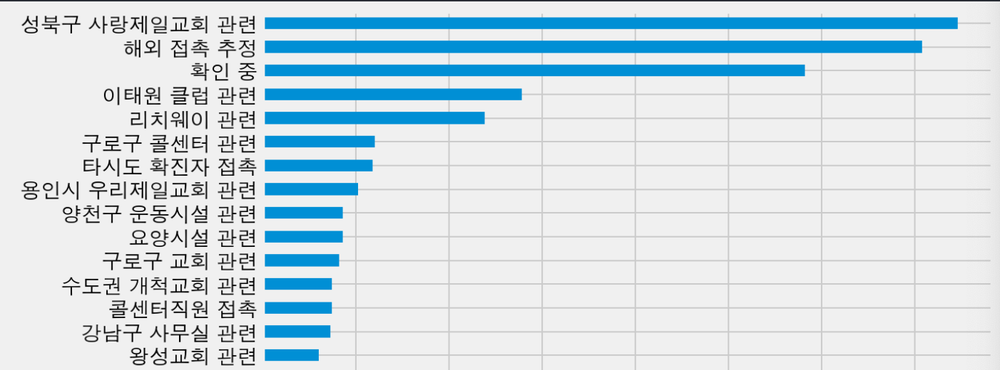

## 경로불명 감염자 통계 파악하기 - 서울의 코로나19

[Google Colab으로 코드 돌려보기](https://colab.research.google.com/drive/1DfOnHOeFIOy4uvoWABL-rucPor9wOyJJ?usp=sharing)

* 오늘(08월 19일) 최고치를 경신함. 151명이 확진 판정을 받음.
* 오늘 기준 서울에만 2360명의 확진자가 있음을 알 수 있음.
* 어제만 해도 해외 접촉 추정이 1위였는데, 성북구 사랑제일교회 관련 확진자가 1위를 기록함.
* 이태원 클럽에서 140명의 관련 확진자가 발생했는데, 이번 사랑제일교회는 3배 가까이 찍음.
* 제일 무서운 건 최근 8주 동안 경로 불명 확진자 비율이 20% 정도 가까이 된다는 점. 지난 확진자 데이터는 감염경로가 확실해서 경로 불명 확진자 비율이 낮긴 함. 근데 곧 다시 높아지겠지?

