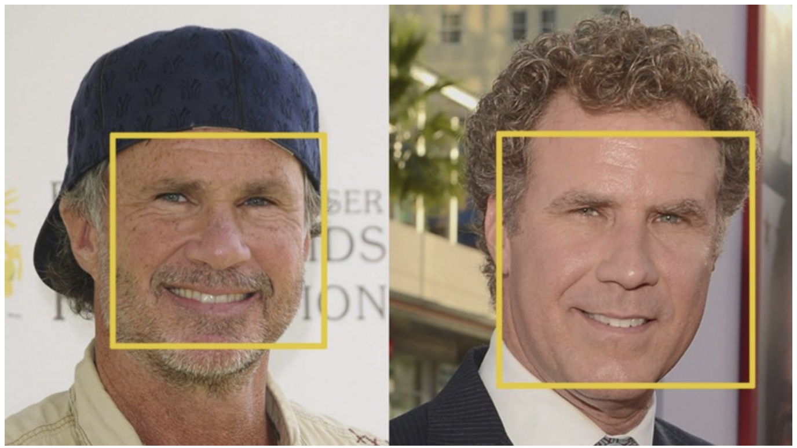
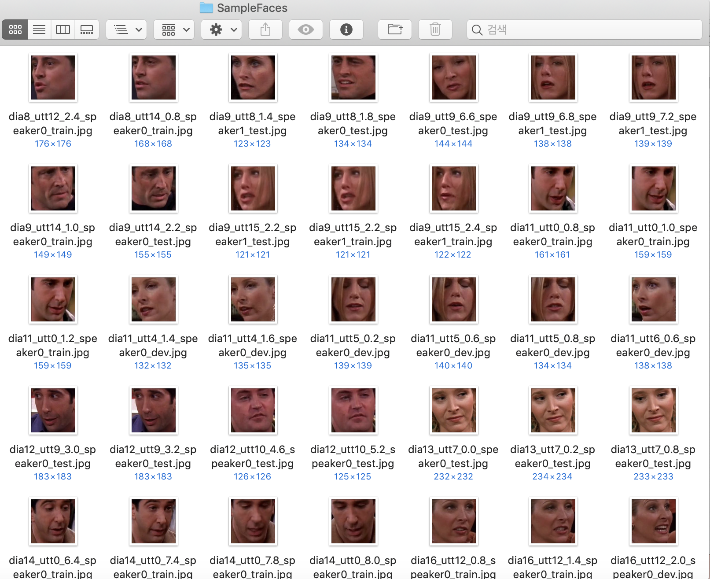
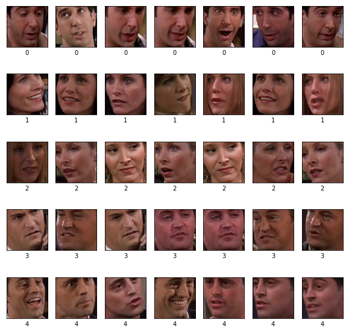

> **Face Clustering** 은 비지도 학습(Unsupervised Learning) 기반의 얼굴 분류 알고리즘이다. 적은 수의 이미지만으로 얼굴 분류를 도전해보자.  

## Face Clustering
사람의 얼굴을 분류한다는 것은 쉬운 일이 아니다. 개와 고양이 분류 모델도 많은 이미지들을 필요로 하듯이, 사람의 얼굴은 서로 특징이 비슷할 뿐만 아니라 비슷하면서도 다른 그 미묘한 차이를 구분해줘야 하기 때문. 그래서 **Face Clustering** 에서는 미리 학습된 신경망 모델의 힘을 빌린다. 

-> 놀랍게도 다른 사람

컴퓨터는 비교적 간단히 위 두 사람을 구분해낸다.

- - - -

**Face Clustering** 은 13,000 개의 얼굴 데이터로 사전에 훈련된 [딥러닝 모델](https://github.com/cmusatyalab/openface)을 통해 이미지로부터 사람의 얼굴을 인식하여 벡터로 임베딩한다. 이후 추출된 얼굴 벡터 값에 간단한 clustering 알고리즘을 적용시켜 얼굴을 분류한다. 초.간.단.


[알고리즘의 개발 저자가 작성한 글](https://www.pyimagesearch.com/2018/07/09/face-clustering-with-python/)에서는 본 알고리즘을 사용해서 5명의 축구선수 이미지 129장을 거의 정확하게 분류한 결과를 보여준다. 코드와 설명이 자세하게 나와있다.

- - - -
## Face Clustering 동작 원리

**Step 1**
1. 이미지에서 얼굴 추출
2. 각각의 얼굴 이미지에서 사람의 눈, 코, 입, 턱의 위치와 윤곽을 잡아내고, 그것을 128 차원의 벡터로 인코딩. 이때 미리 학습시킨 딥러닝 모델을 사용

**Step 2**
3. DBSCAN을 이용하여 인코딩한 결과를 Clustering

> 우리는 몇 명인지도 모르고 누가 누구인지도 모르는 얼굴 이미지들을 잔뜩 넣어주면 된다. 알고리즘이 알아서 분류해준다.   


## 코드 구현
본 포스트에서는 **Face Clustering** 방법을 통해 Label 없는 얼굴 이미지 79장을 분류해보았다. 

### Requirement

```python
# import the necessary packages
import matplotlib.pyplot as plt
import numpy as np
import os

import face_recognition # by Adam Geitgey, a PyImageConf2018 speaker
import cv2

from PIL import Image
```

### 패키지 설치 
**cmake와 dlib의 설치 필요**
``` 
pip install cmake
pip install dlib
pip install face_recognition
```

### 실험에 사용할 토이 데이터셋

미드 프렌즈에서 대량으로 얼굴을 따서 가져왔다. 아래 예시처럼 Cropping 된 얼굴이 아닌 그냥 이미지를 넣어도 작동이 잘 된다.

**총 79장의 이미지를 실험 데이터로 사용하였다.**



- - - -

## Step 1 : Encoding faces via deep learning
```python
# loop over the image paths
data = []

for (i, imagePath) in enumerate(imagePaths):

    # load the input image and convert it from BGR (OpenCV ordering) to dlib ordering (RGB)
    print("[INFO] processing image {}/{}".format(i + 1,len(imagePaths)), end = '\r') # 작업량 카운트
    image = cv2.imread(imagePath)
    # OpenCV’s default BGR to RGB, dlib가 rgb만 받음.
    rgb_img = cv2.cvtColor(image, cv2.COLOR_BGR2RGB) 

    # 인물의 얼굴을 좌표로 반환. (top, right, bottom, left)
    boxes = [(0,image.shape[0],image.shape[1],0)] 
#    boxes = face_recognition.face_locations(rgb,model="detection_method")

    # 각 이미지마다 128 차원으로 encoding된 face 벡터를 반환한다.
    encodings = face_recognition.face_encodings(rgb_img, boxes)

    # build a dictionary of the image path, bounding box location, and facial encodings for the current image
    d = {"imagePath": imagePath, "loc": boxes, "encoding": encodings}
    data.append(d)

#    한 이미지에 여러 얼굴 잡힐 경우
#    d = [{"imagePath": imagePath, "loc": box, "encoding": enc} for (box, enc) in zip(boxes, encodings)]
#    data.extend(d)

print(len(data))
```
    [INFO] processing image 79/79

현재 데이터는 cropping 된 얼굴 이미지를 가져왔으므로 기본 이미지 크기를 곧바로 box 테두리(크기)로 설정해주었다. 만약 이미지 원형을 사용할 경우  
`boxes = face_recognition.face_locations(rgb,model="detection_method")` 코드의 주석을 해제해주어야 한다.

위 코드를 실행시키면 79장의 각각의 이미지에 대해서 아래의 3가지 정보가 담긴 Dictionary를 얻을 수 있다.

1. 입력 이미지의 경로
2. 이미지의 얼굴 위치(즉, 경계 상자)
3. 128d 인코딩 자체

## Step 2 : Clustering faces
이제 128차원 벡터로 인코딩된 얼굴 데이터들을 Clustering 해준다.

저자는 **Automatic Face Clustering** 을 위해 분류 개수 또한 자동으로 계산해주는 Density-Based or Graph-Based Clustering algorithm을 사용하라고 권장한다.

	1. Density-based spatial clustering of applications with noise (DBSCAN)
	2. Chinese whispers clustering

이 중 구현이 쉬운 DBSCAN 알고리즘을 사용하였다.

```python
encodings = [d["encoding"] for d in data]
# print(np.array(encodings).shape)

# flatten encoding array (79,1,128) --> (79,128)

encoding_new = []
for e in encodings:
    encoding_new.append(np.array(e).flatten())
print("shape: ", np.array(encoding_new).shape)
```
    shape: (79, 128)
    
```python
# cluster the embeddings
print("[INFO] clustering...")
clt = DBSCAN(metric = "euclidean", n_jobs = 4)
clt.fit(encoding_new)
print(clt.labels_)

# determine the total number of unique faces found in the dataset
labelIDs = np.unique(clt.labels_)
#print(labelIDs)
numUniqueFaces = len(np.where(labelIDs > -1)[0])
print("[INFO] # unique faces: {}".format(numUniqueFaces))
print("군집 별 개수:",collections.Counter(clt.labels_))
```

[INFO] clustering...
[ 0  3  0  1  0  1  0  1  1  2  2  1 -1  2  0  3  1  1  4  0  3  1  1  3
  4  0  2  4  4  1  1  2  2  3  1 -1  1  0  1  2  4  1  4  1  1  1  1  4
  3  4  0  0 -1  4  1  0  2  4  1  4  0 -1  3  3  1  1  2  3  2 -1 -1  3
  0  4 -1  2  4  1  2]
[INFO] # unique faces: 5
군집 별 개수: Counter({1: 24, 0: 13, 4: 13, 2: 12, 3: 10, -1: 7})
이미지 7 장 분류 실패

## Clustering 결과
```python
label_out = []
label_0 = []
label_1 = []
label_2 = []
label_3 = []
label_4 = []

for i,d in enumerate(data):
    if clt.labels_[i] == -1 :
        label_out.append(data[i]['imagePath'])
    elif clt.labels_[i] == 0 :
        label_0.append(data[i]['imagePath'])
    elif clt.labels_[i] == 1 :
        label_1.append(data[i]['imagePath'])
    elif clt.labels_[i] == 2 :
        label_2.append(data[i]['imagePath'])
    elif clt.labels_[i] == 3 :
        label_3.append(data[i]['imagePath'])
    elif clt.labels_[i] == 4 :
        label_4.append(data[i]['imagePath'])       

# Result of Clustering without outlier
label_total = label_0[:7] + label_1[:7] + label_2[:7] + label_3[:7] + label_4[:7]

plt.figure(figsize=(10,10))
for i,img_dir in enumerate(label_total):

    img = cv2.imread(img_dir)
    plt.subplot(5,7,i+1)
    plt.xticks([])
    plt.yticks([])
    plt.xlabel(str(int(i/7)))
    plt.grid(False)

    # show color image
    img_color = img.copy()
    img_color[:, :, 0] = img[:, :, 2]
    img_color[:, :, 2] = img[:, :, 0]
    plt.imshow(img_color)

plt.show()
```



**성공적으로 분류가 잘 되었다.** 

벡터로 얼굴 윤곽 좌표를 따온 것이라 얼굴의 명암이 달라도 잘 분류해내는 것 같다. 사실 레이첼과 모니카가 일부 섞여있지만 흘깃 보면 잘 모른다. 얼굴이 뭉개진 부분이 많은데 Resolution 을 올리면 더 성능이 올라갈 것 같다. 79개의 데이터로 이정도 성능! 굿굿 

연구에 사용하려고 많은 데이터 개수로도 실험해봤는데 군집이 잘 되지 않는다. 😭
역시 연구에 쓰는 것은 무리인 것으로.. 

- **경험 상 100 ~ 500 개의 데이터에서 가장 성공적으로 작동하는 알고리즘**
- 데이터를 더 늘리면 군집이 잘 되지 않는다.

### Reference

- https://github.com/ageitgey/face_recognition
- https://www.pyimagesearch.com/2018/07/09/face-clustering-with-python/
- https://medium.com/@jongdae.lim/%EA%B8%B0%EA%B3%84-%ED%95%99%EC%8A%B5-machine-learning-%EC%9D%80-%EC%A6%90%EA%B2%81%EB%8B%A4-part-4-63ed781eee3c


