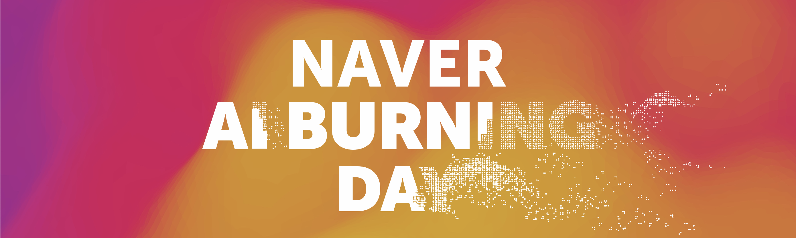
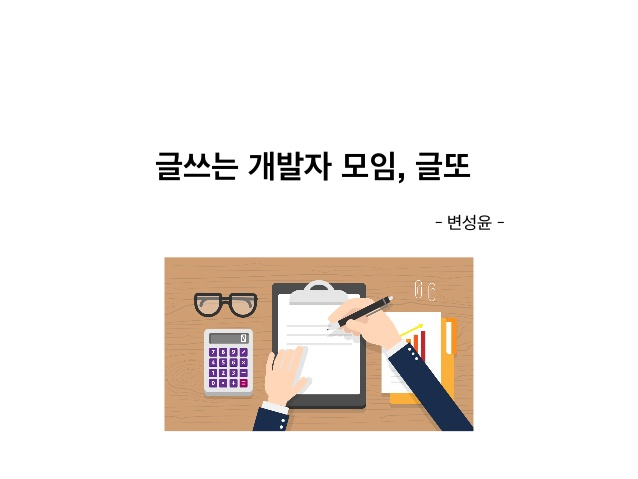

## 🌞 2020년 마무리
2020년은 나의 많은 것이 달라지는 해 였다. 석사 졸업 논문을 발표하고 사 년 동안 생활했던 연구실 자리를 정리했다. 연구실 자리를 정리함과 동시에 자취방 계약도 마무리 되어서 이사 준비에도 바빴다. 특히 11월부터 12월 학위논문 발표 준비 기간 동안에는 진짜 말 그대로 너무  너무 바빴다. 20년 초부터 연구했던 내용을 학위논문에 넣으려 했는데 그 연구가 타 대학교와 협업하여 진행했던 연구여서 아예 처음부터 다시 갈아 엎었어야 했다. 당시에 동일한 내용을 국내 학회에 게재하기 위해 서론부터 결론까지 논문 작업을 하고 있었는데 내용을 똑같이 적으면 안된다는 것을 11월 초에 알게 되었다. (타 대학교와 협업한 연구이기에 내가 논문을 작성한 부분도 문제가 될 수도 있다고 한다) 허허. 멘탈 바사삭 와장창. 그래서 논문 아웃라인을 다시 잡고, 새로운 연구 내용을 추가하고, 와중에 협업도 계속 진행하고, 약 3주 동안을 살인적인 스케줄로 살았다. 매일 하루를 몬스터와 커피로 시작하고 몰려오는 졸음을 이겨내고자 자일리톨 껌을 달고 살고 오전 5시 쯤에 기절하듯이 잠들었다. 잠을 줄여 일하는 것이 능률이 좋지 않음을 알지만 현실적으로 어쩔수 없어서. 잠은행에 몇 달치 잠을 대출 받아서 논문 작업에 바쳤다. 끝끝내 논문 작업을 마치고 돌이켜 회상해보니 살면서 가장 바쁘고 치열했던 순간이 아니었을까 싶다. 비록 다시는 겪고 싶지 않은 고난의 시기였지만 나의 내적 성장에 어떻게든 밑거름이 된 시기였다고 생각한다. 

학위논문 발표를 마치고 감사의 글을 적을 때 비로소 졸업이 실감이 났다. 감사의 글 페이지는 짧은 글이지만 굉장히 오랜 시간 작업했다. 감사한 분들을 추려야 하고 순서를 정해야 하고 또 너무 진부한 멘트를 써도 별로니까, 참 끝까지 쉬운게 하나 없다. 오랫동안 지도해주신 지도 교수님께 감사를 표하고, 심사해주신 교수님 두 분께도 감사의 마음을 전하고, 대학원 연구실 동료들에게도 감사의 마음을 전하고, 내 정신적 지주였던 대학교 동기 친구들 등 소중한 사람들의 이름을 담았다. 동네 친구들도 적고 싶었는데 뭔가 대학교랑 관련없는 사람들을 담기가 어려운 페이지라서 ㅋㅋ 무튼 올해는 나의 길고도 긴 학업 생활을 마무리 한 뜻깊은 해로 기억에 남을 듯 하다. 

- - - -
## 👩‍💻 스터디 및 자기계발
그 밖에 2020년 큼직하게 진행했던 개인/팀 프로젝트 몇몇. 연구실 외에 여러 프로젝트를 참가하다보니 코로나 때문에 처진 생활에 활력을 얻을 수 있어서 좋았다.

### 네이버 AI Burning 해커톤

대학교 동기랑 스터디에서 사겼던 친구랑 팀을 꾸려 `인공지능 앱/웹 개발 해커톤`에 지원서를 냈었다. 대학원 졸업 전에 해커톤에 나가보고 싶기도 했고, 연구실에서 배웠던 지식을 토대로 백엔드 개발을 경험해보고 싶었다. 당시 사람의 포즈를 좌표로 받아내어 음악을 만들어내는 기획안 ([Somebody](https://github.com/woodongk/Somebody))을 제출하였는데 운 좋게도 본선 30 팀 내로 선정되어 2박 3일 동안 네이버 커텍트원에서 해커톤을 달렸었다. 무엇보다 밥이 정말 맛있고 숙소 시설도 엄청 좋았어서 2박 3일 내내 행복하게 개발했던 기억이 난다. 자칫 일정이 조금만 더 늦었다면 코로나 때문에 커넥트원에서 오프라인 활동을 못했을텐데 다행히(?) 갔다온 뒤로 코로나가 퍼졌다. 
다른 사람들의 프로젝트도 구경해보고, 밤새서 열정적으로 코딩도 해보고, 어쩌다보니 2020년의 마지막 외부 단체 활동이 되버려 기억에 많이 남는다.

### 밑시딥 2 스터디 
케라콘 스터디원들과 함께 시작했던  `밑바닥부터 시작하는 딥러닝 2` 스터디. 스터디는 19년도 말부터 시작했는데 코로나로 인해 이후 진행이 어려워져서 아쉽게도 혼자서 끝마쳤다. 밑시딥2는 word2vec, seq2seq, attention 등 다양한 NLP 관련 핵심 알고리즘을   `numpy`로 하나하나 구현해보는 책이다. 책에서 다루는 수준이 매우 깊이 있고, 실제 논문을 같이 보면서 이해하기에도 도움이 많이 되었다. 그런데 책을 무려 다섯 달 동안이나 봤다;; 데드라인 기반 스터디의 중요성 😅

### 카카오 프로젝트 100 - 1일 1커밋

하루에 1시간은 개인 공부하는 습관을 기르기 위해 시작해 본 카카오프로젝트 100. 그 중에서도 하루에 하나의 잔디를 심는 프로젝트에 참가하였다. 의미없는 커밋을 남발하는 것은 지나도 후회만 남을 것 같아 최대한 하루 30분 내지 1시간은 커밋 만들기 용으로 시간을 투자했다. 비록 어느 순간부터 학위논문 발표 준비로 시간이 1도 안 나서 인증을 포기했던 아쉬운 기억. 글또 가입하고 우연히 매니저님을 만나게 되어 반가웠다 ㅎㅎ 

### 글또

변성윤님 블로그를 자주 찾아보다가 알게된 글또. 평상시에도 종종 시간 내서 글 쓰는 것을 좋아하는데 글쓰는 커뮤니티가 있다는 것이 반가워 4기 때부터 모집 시기를 노리다가 5기에 참여하였다. 다만 참여와 동시에 바쁜 일이 밀려와서 체계적으로 글을 작성하지 못했다. 올해는 보다 체계적으로 글을 작성해보려 한다. 

- - - -
## 📚 2021년 목표
21년 부로 당장 백수가 되었다. 공부를 더 하고 싶어서 네이버 부스트캠프 교육 프로그램에 지원하였는데 아쉽게도 2차 코딩테스트에서 떨어졌다. 힝. 해당 코스웍을 토대로 취업을 준비하려 했는데, 떨어지니 막막함이 크다. 당장 월요일부터는 스터디 카페를 끊고 백수 생활을 체계적으로 하려 한다. 계획대로 사는 것이 어려운 P 지만, "이번 만큼은 제대로 해봐야지" 라고 다짐을 하며 일기와 스터디플래너를 구비하였다.

2021년에는 물론 **취업**이 영순위 목표이지만, 대학원 생활 때 못했던 취미 생활도 즐기는 한 해가 되고 싶다. 
올해는 코로나로 연말 연초 모임이 취소 되어서 한 해를 시작하는 느낌이 여느 때보다 덜해서 아쉽다. 글또 글을 적어내며 뜻깊은 한 해가 되길, 작년보다 성장하는 한 해가 되길 바란다.

